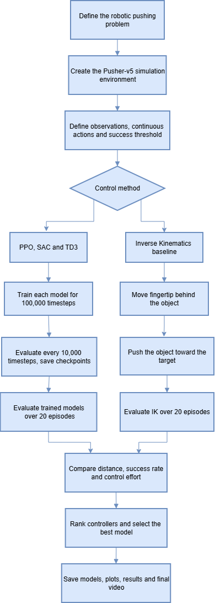

# Robotic Pusher Reinforcement Learning

A comparative reinforcement learning project for robotic pushing in the **MuJoCo Pusher-v5** environment.

The project trains and evaluates **PPO, SAC, and TD3** reinforcement learning agents and compares their performance using multiple robotic-control metrics. A conventional **Inverse Kinematics (IK)** controller is also implemented as a non-learning baseline.

## Project Overview

The objective of this project is to control a robotic arm to push an object toward a target position while comparing different reinforcement learning and traditional control approaches.

The project includes:

- Proximal Policy Optimization (PPO)
- Soft Actor-Critic (SAC)
- Twin Delayed Deep Deterministic Policy Gradient (TD3)
- Inverse Kinematics baseline
- Training and learning-curve analysis
- Held-out evaluation
- Success-rate analysis
- Distance and control-effort analysis
- Robotic simulation using MuJoCo

## System Architecture



## Reinforcement Learning Approach

Three continuous-control reinforcement learning algorithms were trained and compared.

### PPO

**Proximal Policy Optimization (PPO)** is an on-policy reinforcement learning algorithm that uses clipped policy updates to improve training stability.

### SAC

**Soft Actor-Critic (SAC)** is an off-policy algorithm that optimizes both expected reward and policy entropy, encouraging exploration while learning continuous-control policies.

### TD3

**Twin Delayed Deep Deterministic Policy Gradient (TD3)** is an off-policy continuous-control algorithm that improves deterministic policy learning through twin critics, delayed policy updates, and target-policy smoothing.

The three algorithms were evaluated during training and again using held-out evaluation episodes to compare their final performance.

## Evaluation Metrics

The reinforcement learning agents were evaluated using multiple metrics, including:

- Episode Return
- Final Object-to-Goal Distance
- Success Rate
- Fingertip-to-Object Distance
- Control Effort
- Learning-Curve Performance
- Held-Out Evaluation Performance

A successful episode is determined based on whether the object reaches the target within the defined distance threshold.

## Inverse Kinematics Baseline

A traditional robotic controller was implemented as a non-learning baseline for comparison with the reinforcement learning agents.

The controller uses:

- Damped Least-Squares Differential Inverse Kinematics
- Jacobian-based motion control
- Joint-space PD control
- Approach and pushing phases
- Action clipping based on robot control limits

The controller first moves the robotic fingertip behind the object relative to the goal direction. Once the fingertip reaches the appropriate approach position, it pushes the object toward the target.

The Inverse Kinematics controller is evaluated using the same Pusher-v5 environment and records:

- Episode Return
- Final Planar Distance
- Success Rate
- Mean Fingertip-to-Object Distance
- Mean Control Effort
- Execution Time

## Demo

A simulation of the selected reinforcement learning controller is available here:

[View Best Controller Simulation](pusher_results_300_default_reward/best_controller_final_test.mp4)

## Results

The repository contains training and evaluation results for PPO, SAC, and TD3, along with results from the Inverse Kinematics baseline.

The generated results include:

- Individual algorithm learning results
- Combined learning-curve results
- Final held-out evaluation episodes
- Final model comparison summary
- Performance plots
- Best-controller simulation
- Inverse Kinematics episode results
- Inverse Kinematics performance curves
- Held-out IK evaluation plots

These results allow the learned reinforcement learning policies to be compared with each other and with a conventional robotics-control approach.
```

## Technologies

- Python
- Reinforcement Learning
- PPO
- SAC
- TD3
- Stable-Baselines3
- Gymnasium
- MuJoCo
- NumPy
- Pandas
- Matplotlib
- Inverse Kinematics
- Robotic Control
